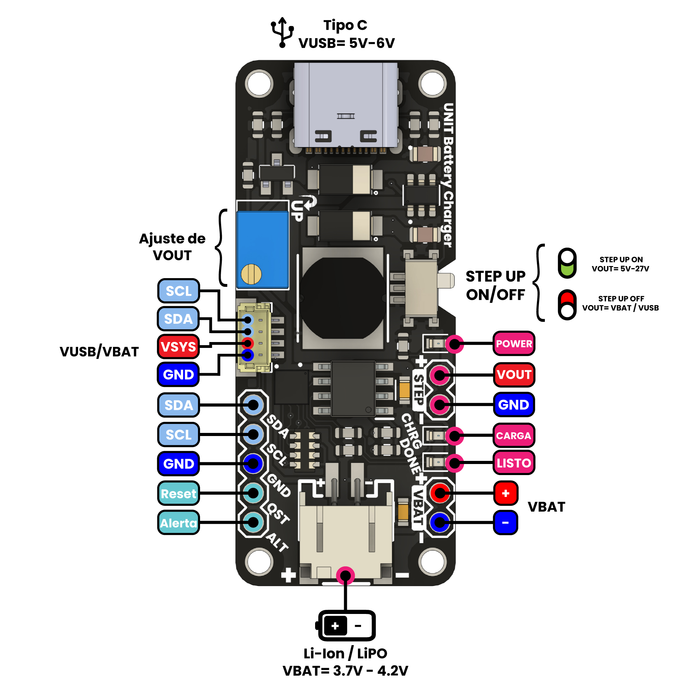

# UNIT LiPo Charger Boost & I2C Monitor

El **UNIT LiPo Charger Boost & I2C Monitor** es un módulo avanzado de carga y monitoreo para baterías LiPo de una celda (3.7V a 4.2V) que integra un cargador TP4056, un elevador de voltaje MT3608 con salida limitada a 27V, y un monitor de batería MAX17048 a través de I2C. Este módulo es ideal para aplicaciones donde se requiere carga eficiente y monitoreo de la batería en tiempo real.

- **Carga de Batería LiPo**: Con dos opciones de corriente de carga seleccionables mediante pads (200 mA o 1 A).
- **Step-up MT3608**: Eleva el voltaje de la batería o de una entrada USB Tipo C hasta 27V, con una potencia nominal de salida de 4W.
- **Monitoreo de Batería**: El MAX17048 permite conocer el nivel de carga y voltaje de la batería mediante I2C.
- **Compatibilidad Qwiic/Stemma**: Conector JST con opción de energizar módulos Qwiic mediante el bus de voltaje del sistema.

## Características del Módulo

- **Voltaje de entrada (VIN)**: USB Tipo C a 5V o mediante pads de alimentación (máximo 6V).
- **Voltaje de carga de batería**: 3.7V nominal (4.2V máximo).
- **Potencia de salida**: Hasta 4W en el step-up MT3608, con eficiencia variable según el voltaje de entrada.
- **Conectores**:
  - JST de 2.0 mm para la batería LiPo.
  - Header de 2 pines (2.54 mm) para extraer el voltaje de batería.
  - Header de 5 pines para el monitor I2C de batería (MAX17048): `SDA`, `SCL`, `GND`, `QST` (reset), y `ALT` (alert).
- **Selección de corriente de carga**: Pad en la parte posterior para elegir entre carga de 200 mA o 1 A.
- **Compatibilidad Qwiic/Stemma**: Pad tipo jumper en la parte inferior para conectar el voltaje del sistema al conector Qwiic. *Advertencia: se recomienda una regulación adicional a 3.3V para cumplir con el estándar Qwiic*.

---

## Pinout

A continuación se muestran los diagramas de pinout del módulo para la parte frontal y posterior. Haz clic en cualquiera de las imágenes para más detalles en [UNIT Electronics](https://www.uelectronics.com).

### Pinout Frontal
[](https://www.uelectronics.com)

### Pinout Posterior
[](https://www.uelectronics.com)

---

## Tabla de Conexión de Pines

La siguiente tabla detalla los pines de conexión principales del módulo **UNIT LiPo Charger Boost & I2C Monitor** para el header de 5 pines:

| PIN  | Descripción                   | Función en el MAX17048   |
| ---- | ----------------------------- | ------------------------ |
| SDA  | Línea de datos I2C            | Conectar a SDA del MCU   |
| SCL  | Línea de reloj I2C            | Conectar a SCL del MCU   |
| GND  | Tierra                        | Conectar a GND del MCU   |
| QST  | Reset del MAX17048            | Pin de reset (opcional)  |
| ALT  | Alerta de nivel de batería    | Pin de alerta (opcional) |

---

## Especificaciones Adicionales

- **Curvas de Caracterización**: Incluye las curvas de potencia de salida del step-up MT3608 para un voltaje de batería de 3.4V y 3.5V, mostrando el comportamiento de potencia en función del voltaje de salida. La eficiencia del step-up varía según el voltaje de entrada; para voltajes más bajos, la potencia máxima puede disminuir, mientras que para voltajes cercanos a 5V, la potencia de salida puede oscilar entre 2W y 3W.
- **Advertencia de Uso**: El módulo debe operarse preferiblemente con una batería LiPo de entre 3.7V a 4.2V y con una entrada VIN de USB Tipo C a 5V o mediante los pads VIN, con un máximo de 6V.

## Carpeta de Modelos Fritzing

Este repositorio incluye una carpeta con los modelos de Fritzing del módulo para facilitar su integración en diagramas y documentación técnica de proyectos.

---

## Documentación

- **Biblioteca MAX1704X**: Este repositorio contiene una biblioteca para el control del MAX17048 usando Arduino IDE y MicroPython. Con esta biblioteca, puedes obtener información sobre el voltaje de la batería, el porcentaje de carga y el estado de descarga.

  [Repositorio MAX1704X](https://github.com/UNIT-Electronics/MAX1704X_lib)

  ### Compatibilidad
  - **Arduino IDE**
  - **MicroPython**

---

## Cómo Empezar

A continuación se presenta un ejemplo de cómo comenzar a usar el monitor MAX17048 en el módulo **UNIT LiPo Charger Boost & I2C Monitor**.

### Ejemplo en MicroPython

1. **Conexiones**:
   - Conecta el pin `SDA` del módulo al pin `SDA` de tu microcontrolador.
   - Conecta el pin `SCL` del módulo al pin `SCL` de tu microcontrolador.
   - Conecta `GND` a `GND` del microcontrolador.

2. **Instalación de la Biblioteca**:
   - Descarga la biblioteca MAX1704X desde el repositorio y asegúrate de incluirla en tu entorno de trabajo.

3. **Código Ejemplo**:
   ```python
   from max17048 import MAX17048
   from machine import I2C, Pin

   i2c = I2C(1, scl=Pin(22), sda=Pin(21))  # Ajusta los pines según tu microcontrolador
   battery_monitor = MAX17048(i2c)

   # Leer el voltaje de la batería
   voltage = battery_monitor.get_voltage()
   print("Voltaje de la batería:", voltage, "V")

   # Leer el porcentaje de carga
   charge = battery_monitor.get_charge()
   print("Carga de la batería:", charge, "%")
   ```

### Ejemplo en C++ (Arduino IDE)

1. **Instalación de la Biblioteca**:
   - Descarga la biblioteca MAX1704X e instálala en el Arduino IDE desde [Repositorio MAX1704X](https://github.com/UNIT-Electronics/MAX1704X_lib).

2. **Código Ejemplo**:
   ```cpp
   #include <Wire.h>
   #include <MAX17048.h>

   MAX17048 batteryMonitor;

   void setup() {
       Serial.begin(9600);
       Wire.begin();

       // Inicializar el monitor de batería
       batteryMonitor.begin();
   }

   void loop() {
       // Leer el voltaje de la batería
       float voltage = batteryMonitor.getVoltage();
       Serial.print("Voltaje de la batería: ");
       Serial.print(voltage);
       Serial.println(" V");

       // Leer el porcentaje de carga
       int charge = batteryMonitor.getCharge();
       Serial.print("Carga de la batería: ");
       Serial.print(charge);
       Serial.println(" %");

       delay(1000);
   }
   ```

Estos ejemplos ofrecen un punto de partida para implementar el monitoreo de batería con el MAX17048 en tus proyectos, tanto en MicroPython como en el entorno de Arduino IDE.