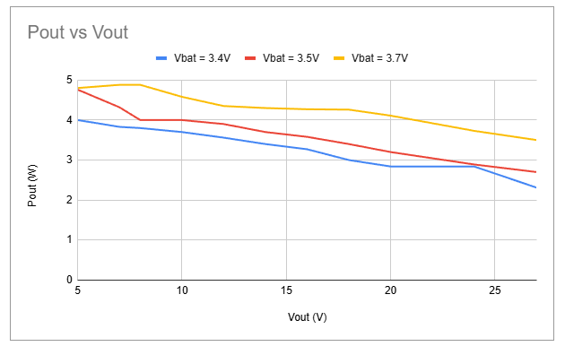
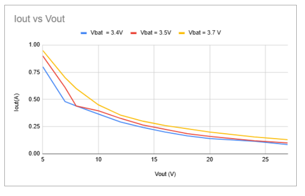

# UNIT LiPo Charger Boost & I2C Monitor

**UNIT LiPo Charger Boost & I2C Monitor** es un módulo avanzado de carga y monitoreo para baterías LiPo de una celda (3.7V a 4.2V) que integra un cargador TP4056, un elevador de voltaje MT3608 con salida limitada a 27V, y un monitor de batería MAX17048 a través de I2C. Este módulo es ideal para aplicaciones donde se requiere carga eficiente y monitoreo de la batería en tiempo real.

- **Carga de Batería LiPo**: Con dos opciones de corriente de carga seleccionables mediante pads (200 mA o 1 A).
- **Step-up MT3608**: Eleva el voltaje de la batería o de una entrada USB Tipo C hasta 27V. Con una potencia nominal de salida máxima de 4W en función del voltaje de entrada.
- **Monitoreo de Batería**: El MAX17048 permite conocer el nivel de carga y voltaje de la batería mediante I2C.
- **Compatibilidad Qwiic/Stemma**: Conector JST con opción de energizar módulos Qwiic mediante el bus de voltaje del sistema (VSYS -> VBAT-6V max).

## Características del Módulo

- **Voltaje de entrada (VIN)**: USB Tipo C a 5V o mediante pads de alimentación (máximo 6V).
- **Voltaje de carga de batería**: 3.7V nominal (4.2V máximo).
- **Potencia de salida**: Hasta 4W en el step-up MT3608, con eficiencia variable según el voltaje de entrada.
- **Conectores**:
  - JST de 2.0 mm para la batería LiPo.
  - Header de 2 pines (2.54 mm) para extraer el voltaje de batería.
  - Header de 2 pines (2.54 mm) para extraer el voltaje de salida del step-up MT3608.
  - Header de 5 pines para el monitor I2C de batería (MAX17048): `SDA`, `SCL`, `GND`, `QST` (reset), y `ALT` (alert).
- **Selección de corriente de carga**: Pad en la parte posterior para elegir entre carga de 200 mA o 1 A.
- **Compatibilidad con salida Qwiic/Stemma**: Este módulo está preparado para conectar las líneas de I2C (SDA y SCL) y tierra (GND) al conector Qwiic/Stemma, asegurando la compatibilidad en la comunicación con dispositivos que usan este estándar. Además, incluye un pad tipo jumper en la parte inferior que, al cerrarse, permite enviar el voltaje del sistema (VSYS) al conector Qwiic/Stemma para alimentar los módulos conectados a través de este bus. VSYS puede variar entre el voltaje de batería (3.7V) hasta un máximo de 6V (Vin).

Advertencia: debido a que el estándar Qwiic opera a 3.3V, se recomienda utilizar un regulador de voltaje posterior a la salida JST del módulo para reducir VSYS a 3.3V y proteger los dispositivos Qwiic conectados.

---

## Pinout

A continuación se muestran los diagramas de pinout del módulo para la parte frontal y posterior. Haz clic en cualquiera de las imágenes para más detalles en [UNIT Electronics](https://www.uelectronics.com).

### Pinout Frontal
[](https://www.uelectronics.com)

### Pinout Posterior
[](https://www.uelectronics.com)

---

## Tabla de Conexión de Pines

La siguiente tabla detalla los pines de conexión principales del módulo **UNIT LiPo Charger Boost & I2C Monitor** para el header de 5 pines:

| PIN  | Descripción                   | Función en el MAX17048   |
| ---- | ----------------------------- | ------------------------ |
| SDA  | Línea de datos I2C            | Conectar a SDA del MCU   |
| SCL  | Línea de reloj I2C            | Conectar a SCL del MCU   |
| GND  | Tierra                        | Conectar a GND del MCU   |
| QST  | Reset del MAX17048            | Pin de reset (opcional)  |
| ALT  | Alerta de nivel de batería    | Pin de alerta (opcional) |

---

## Especificaciones Adicionales

- **Curvas de Caracterización**: Las curvas de potencia y corriente de salida del step-up MT3608 para niveles de batería de 3.4V y 3.5V, muestran la variación de la potencia y corriente en función del voltaje de salida con una batería LiPo. La eficiencia del step-up depende del voltaje de entrada: para voltajes de salida elevados, cercanos a 27V, la potencia máxima se reduce a aproximadamente 2-3W; mientras que, para voltajes de salida alrededor de 5V, la potencia de salida se estabiliza en torno a 4W.

**Advertencia de Uso***: Es preferible operar el módulo con una batería LiPo de entre 3.7V y 4.2V, o con una entrada VIN de 5V mediante USB Tipo C o los pads VIN, manteniendo un máximo de 6V.





## Carpeta de Modelos Fritzing

Este repositorio incluye una carpeta con los modelos de [Fritzing](recources/Fritzing/UE0001-UNITBatteryChargerI2C.fzpz) del módulo para facilitar su integración en diagramas y documentación técnica de proyectos.


## Links de compra
Puedes adquirir el módulo UNIT LiPo Charger Boost & I2C Monitor directamente en [UNIT Electronics](www.electronics.com).

---

## Documentación

- **Biblioteca MAX1704X**: Este repositorio contiene una biblioteca para el control del MAX17048 usando Arduino IDE y MicroPython. Con esta biblioteca, puedes obtener información sobre el voltaje de la batería, el porcentaje de carga y el estado de descarga.

  [Repositorio MAX1704X](https://github.com/UNIT-Electronics/MAX1704X_lib)

  ### Compatibilidad
  - **Arduino IDE**
  - **MicroPython**

---

## Cómo Empezar

A continuación se presenta un ejemplo de cómo comenzar a usar el monitor MAX17048 en el módulo **UNIT LiPo Charger Boost & I2C Monitor**.

### Ejemplo en MicroPython

1. **Conexiones**:
   - Conecta el pin `SDA` del módulo al pin `SDA` de tu microcontrolador.
   - Conecta el pin `SCL` del módulo al pin `SCL` de tu microcontrolador.
   - Conecta `GND` a `GND` del microcontrolador.

2. **Instalación de la Biblioteca**:
   - Descarga la biblioteca MAX1704X desde el repositorio y asegúrate de incluirla en tu entorno de trabajo.

3. **Código Ejemplo**:

```python

from max17048 import MAX17048
from machine import I2C, Pin

i2c = I2C(1, scl=Pin(22), sda=Pin(21))  # Ajusta los pines según tu microcontrolador
battery_monitor = MAX17048(i2c)

# Leer el voltaje de la batería
voltage = battery_monitor.get_voltage()
print("Voltaje de la batería:", voltage, "V")

# Leer el porcentaje de carga
charge = battery_monitor.get_charge()
print("Carga de la batería:", charge, "%")
```
## Notas de Uso
**Selección de Corriente de Carga**: Utiliza los pads de la parte posterior para configurar la corriente de carga:

    - 200 mA: Ideal para cargas lentas, prolongando la vida de la batería.
    - 1 A: Carga rápida, recomendada para situaciones de carga de alta velocidad.

> **Importante**: El estándar Qwiic funciona a 3.3V, por lo que, al usar VSYS como fuente de alimentación, es aconsejable añadir un regulador de voltaje después de la salida JST del módulo para reducir VSYS a 3.3V y evitar posibles daños a los dispositivos Qwiic conectados.

Con el UNIT LiPo Charger Boost & I2C Monitor, puedes monitorear el estado de tu batería, alimentar módulos Qwiic o periféricos a través del bus del sistema y obtener una potencia de salida estable en aplicaciones donde se requiera voltaje elevado.

¡Comienza tu proyecto de carga de baterías y monitoreo con el UNIT LiPo Charger Boost & I2C Monitor hoy mismo!
